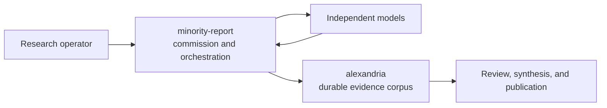

# Research Corpus has moved

This repository is archived in favor of
[**dhk/alexandria**](https://github.com/dhk/alexandria), the authoritative,
git-backed corpus for multi-model research.

No research artifacts were ever stored here, so there is no content or history
to migrate.

## Where to go

| Need | Repository |
|---|---|
| Research briefs, raw model outputs, comparative analysis, synthesis, schemas, and design records | [dhk/alexandria](https://github.com/dhk/alexandria) |
| The tooling that commissions research, dispatches models, grades claims, serves the MCP/web interfaces, and packages deployments | [dhk/minority-report](https://github.com/dhk/minority-report) |

## Why there are two repositories

Research evidence and the software that produces it have different lifecycles.

- **Alexandria changes deliberately:** it preserves provenance, raw evidence,
  analyses, and the contracts that describe those artifacts.
- **Minority Report changes quickly:** it owns dispatch, model/provider
  integration, grading, local interfaces, and deployment machinery.

Keeping those concerns separate allows tooling to evolve without rewriting the
research record.

## Installation

There is nothing to install from this repository.

- To work with the corpus, follow
  [Alexandria's README](https://github.com/dhk/alexandria#readme).
- To install or operate the research tooling, follow
  [Minority Report's README](https://github.com/dhk/minority-report#readme).

## License

This redirect repository retains its [MIT License](LICENSE). Licensing for
content or software in the destination repositories is governed by those
repositories.
